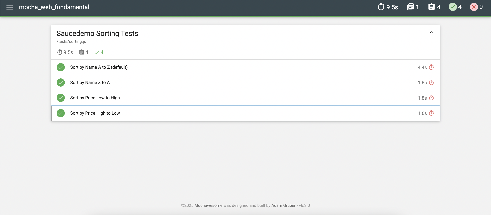

# 🔄 SauceDemo Sorting Tests

Automated Web UI Testing project for [**SauceDemo Website**](https://www.saucedemo.com) using **Selenium WebDriver** and **Mocha**.

## 📋 Overview

This project automates end-to-end UI tests for the SauceDemo website, focusing on:

- ✅ Login functionality validation
- ✅ Product sorting (Name A→Z, Z→A, Price Low→High, High→Low)
- ✅ Page title and logo verification
- ✅ Dropdown interaction and element visibility checks
- ✅ Chrome browser options (e.g., Incognito mode to avoid password popups)

## 📁 Project Structure

```
mocha_web_fundamental/
│
├── tests/
│   └── sorting.js                           # Sorting functionality tests
│
├── images/
│   └── report-result.png                    # Test report screenshot
│
├── package.json                             # Project metadata & npm scripts
├── package-lock.json
└── README.md                                # Project documentation
```

## ⚙️ Tech Stack

| Tool                   | Purpose                                  |
| :--------------------- | :--------------------------------------- |
| **JavaScript (ES6)**   | Test scripting language                  |
| **Selenium WebDriver** | Browser automation framework             |
| **Mocha**              | Test runner                              |
| **Mochawesome**        | Test reporting                           |
| **Node.js + npm**      | Runtime environment & package management |
| **ChromeDriver**       | Web UI execution engine                  |

## 🚀 How to Run the Tests

**Clone the repository:**

```bash
git clone <your-repo-url>
cd <your-folder-name>
```

**Install dependencies:**

```bash
npm install
```

**Run the tests:**

```bash
npm run test
```

## 🧪 Test Scenarios

**1. Sort by Name A to Z (default)** - Tests default alphabetical sorting with login verification
**2. Sort by Name Z to A** - Tests reverse alphabetical sorting
**3. Sort by Price Low to High** - Tests price ascending order
**4. Sort by Price High to Low** - Tests price descending order with browser cleanup

Each test includes dropdown interaction and selection validation using `assert.strictEqual`.

## 📸 Test Report Screenshot

Below is an example of the generated Mochawesome report after running the tests:



## 🧠 Key Learning Points

- Setting up Chrome WebDriver with incognito mode
- Using Mocha test framework with async/await functions
- Element selection with `By.id`, `By.className`, and `By.xpath`
- Dropdown interaction and attribute validation
- Helper functions for code reusability (`setupDriver`, `login`, `selectSort`)
- Assertion testing with `assert.strictEqual`
- Browser session management with `driver.quit()`

## 👩🏻‍💻 Author

**Elsa Farah Fauzia**  
_Senior Software Quality Assurance_  
📍 Jakarta, Indonesia

🔗 [LinkedIn](https://www.linkedin.com/in/elsafarahfauzia/) | [GitHub](https://github.com/elsafarahhf)
